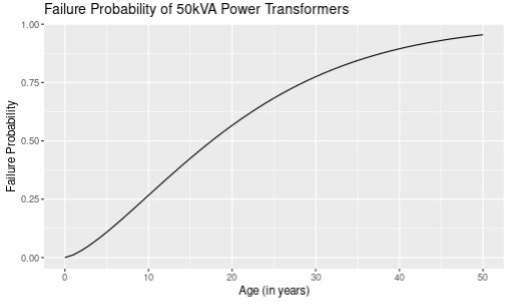
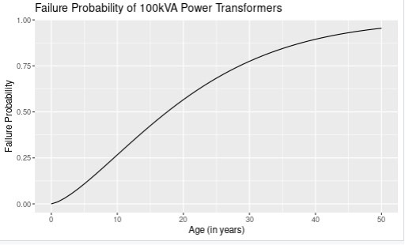
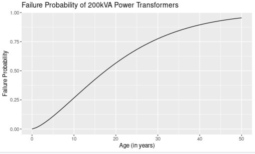
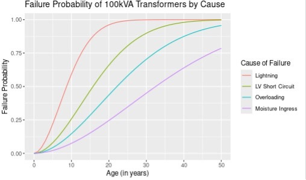
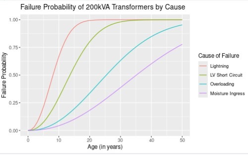
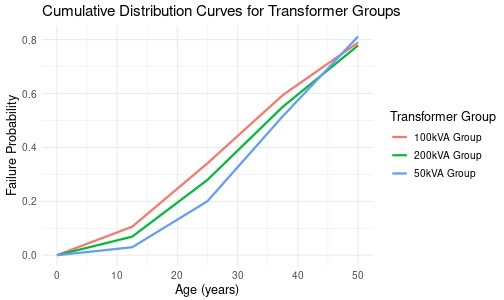

# Transformer Asset Lifespan Modelling
### Diagnostic Failure Prediction Model for Power Transformers using Weibull Analysis

**Final Year Project · BSc Electrical & Electronic Engineering · KNUST, 2024**  
`R` `Weibull Analysis` `Life Data Analysis` `Reliability Engineering`

---

## Overview

Power transformer failures cost utility providers significant revenue and deprive customers of reliable supply. The project applies Weibull analysis to develop a statistical model that predicts failures in distribution transformers by estimating failure probabilities across transformer groups. In doing so, it determines the failure causes that most drastically reduce transformer lifespan and derives failure rate equations to predict lifespan and support proactive maintenance planning.


The model, built in R, was fitted to historical failure records from a regional utility company and validated with a Chi-Square Goodness of Fit Test.

---

## Problem Statement

Transformer failures in distribution networks lead to loss of revenue for the utility provider and loss of power supply to customers. Reactive maintenance strategies are costly and disruptive. A statistical prediction model supports proactive planning by helping operators anticipate failures. This allows them to prioritize replacements and deploy protective measures where they are most needed.

---

## Data

The dataset was obtained from a regional utility company under a data sharing agreement. It covers transformer damage records over a 30-month period.

> **Data sharing note:** The original dataset cannot be shared publicly. The scripts in this repository show the full methodology and data structure. A synthetic dataset with equivalent statistical properties will be added in a future update.

Transformers were grouped by power rating for separate analysis:

| Group | Description |
|---|---|
| 50kVA | Lower-rated distribution transformers |
| 100kVA | Mid-rated distribution transformers |
| 200kVA | Higher-rated distribution transformers |

**Recorded failure causes:** Lightning, LV Short Circuit, Overloading, Moisture Ingress

**Data structure per group (after preprocessing):**

| Column | Description |
|---|---|
| `start_age` | Start of age interval (years) |
| `end_age` | End of age interval (years) |
| `failures` | Number of recorded failures in interval |
| `censored` | 1 if the observation is censored, 0 otherwise |
| `cause_of_failure` | Categorical cause of failure |

---

## Methodology

1. **Data Cleaning** — Resolved missing and erroneous entries
2. **Data Sorting** — Organised records by kVA rating and cause of failure into age-interval format
3. **Weibull Parameter Estimation** — Maximum Likelihood Estimation (MLE) via the `survival` package in R
4. **Visualisation** — Failure probability curves plotted with `ggplot2`
5. **Sensitivity Analysis** — Extended the one-variable model to incorporate cause of failure as a covariate
6. **Comparative Analysis** — Compared parameters and failure rate trajectories across the three groups
7. **Failure Rate Prediction** — Applied estimated parameters to derive a failure rate equation per group
8. **Model Validation** — Chi-Square Goodness of Fit Test at α = 0.05, df = 10

### The Weibull Model

The 2-parameter Weibull hazard function:

```
f(t) = (β/η) · (t/η)^(β−1) · exp(−(t/η)^β)
```

- **β (Beta) — Shape parameter:** governs how the failure rate changes over time. β > 1 indicates an increasing failure rate consistent with wear-out behaviour
- **η (Eta) — Scale parameter:** the characteristic life. The age at which the transformer population begins to see a marked acceleration in failures

---

## Results

### One-Variable Model

Using transformer age as the sole predictor, identical parameters converged across all three groups to give similar aggregate failure trends when cause of failure is not separated out.

| Parameter | Value |
|---|---|
| Shape (β) | 1.429 |
| Scale (η) | 22.7 years |

β > 1 confirms an increasing failure rate across the fleet's lifetime. η ≈ 22.7 years indicates transformers begin experiencing accelerating failures at roughly 22 years of age.





---

### Multi-Variable Model — Parameters by Cause of Failure

Incorporating cause of failure as a covariate substantially improved the model and revealed starkly different characteristic lives depending on how a transformer fails.

#### 50kVA Group (β = 2.92 across all causes)

| Cause | η — Characteristic Life (years) |
|---|---|
| Lightning | 4.9 |
| LV Short Circuit | 17.6 |
| Overloading | 30 |
| Moisture Ingress | 41.9 |

#### 100kVA Group (β = 1.85 across all causes)

| Cause | η — Characteristic Life (years) |
|---|---|
| Lightning | 10.6 |
| LV Short Circuit | 19.2 |
| Overloading | 27 |
| Moisture Ingress | 39.6 |

#### 200kVA Group (β = 2.20 across all causes)

| Cause | η — Characteristic Life (years) |
|---|---|
| Lightning | 9.6 |
| LV Short Circuit | 16.1 |
| Overloading | 30 |
| Moisture Ingress | 41.5 |





**Key findings:**

- **Lightning** is the most destructive failure cause. A 50kVA transformer whose primary failure mode is lightning has a characteristic life of under 5 years — compared to nearly 42 years for one that ages naturally through moisture ingress. The impact is consistent across all three groups.
- **Moisture Ingress** produces the highest characteristic life in every group. Transformers with no external fault exposure and no overloading can remain reliably in service for 40+ years.
- **100kVA transformers** show the steepest failure rates at every life stage, attributed to their placement in locations prone to lightning strikes and their relative dielectric weakness at mid-life.

---

### Comparative Failure Rates by Life Stage

| Life Stage | 50kVA | 100kVA | 200kVA |
|---|---|---|---|
| Infant Stage (0–8 years) | 0.84% | 4.6% | 2.6% |
| Normal Operating Stage (9–35 years) | 11% | 23% | 18% |
| Wear-Out Stage (36–50 years) | 51% | 58% | 54% |



---

### Failure Rate Prediction Equations

The failure rate at age *t* can be estimated for each group using the moisture ingress scale parameter, which best represents natural ageing. Where a transformer operates in conditions prone to lightning or overloading, substitute the corresponding scale parameter from the tables above.

**50kVA:**
```
f_50(t) = (2.9 / 41.9) · (t / 41.9)^1.9 · exp(−(t / 41.9)^2.9)
```

**100kVA:**
```
f_100(t) = (1.9 / 39.6) · (t / 39.6)^0.9 · exp(−(t / 39.6)^1.9)
```

**200kVA:**
```
f_200(t) = (2.2 / 41.5) · (t / 41.5)^1.2 · exp(−(t / 41.5)^2.2)
```

---

### Model Validation — Chi-Square Goodness of Fit

| Rating | X² (One-Variable) | X² (Multi-Variable) | Critical Value (α=0.05, df=10) |
|---|---|---|---|
| 50kVA | 39.06 | 42.66 | 18.307 |
| 100kVA | 43.53 | 36.01 | 18.307 |
| 200kVA | 42.46 | 22.71 | 18.307 |

All X² values exceed the critical value, meaning differences between observed and expected failure frequencies are statistically significant. This reflects limitations in the dataset (see below) rather than a fundamental failure of the Weibull approach. The Weibull distribution still provides a better fit than normal and lognormal distributions on this data.

---

## Recommendations

Based on the model outputs, the following were recommended to the utility company:

1. **Deploy lightning arrestors** across the transformer fleet. Lightning is the single largest driver of premature failure, reducing characteristic life by up to 80% in the 50kVA group.
2. **Schedule targeted inspections** for transformers approaching 22 years of age, as failure rates accelerate substantially from this point across all groups.
3. **Risk-based replacement** for transformers with repeated lightning faults. Their reduced characteristic life makes continued operation uneconomical.
4. **Condition monitoring** for the 100kVA group, which has the highest failure rate at every life stage and the greatest lightning sensitivity.
5. **Expand data recording** to include diagnostic conditions such as voltage levels, oil quality and load data. This would substantially improve model accuracy and allow for a more generalisable model.

---

## Limitations

- The dataset covers a 30-month window, which limits the statistical representativeness of the failure distribution
- Diagnostic conditions (voltage levels, oil quality, load data) were not included in the dataset. 
- The model is valid for the specific transformer population in the dataset and should not be generalised to the broader utility fleet without additional data
- All X² values exceed the critical value, meaning the Weibull fit does not perfectly describe the observed distribution, but remains the best available fit for this data

---

## Repository Structure

```
transformer-lifespan-modelling/
│
├── README.md
├── analysis/
│   ├── general_model.R          # One-variable Weibull model (age as sole predictor)
│   └── multivariable_model.R    # Multi-variable model with cause of failure as covariate
└── outputs/
    └── *.png                    # Failure probability charts (insert figures here)
```

---

## How to Run

**Requirements:** R (≥ 4.0), RStudio recommended

```r
install.packages(c("survival", "survminer", "ggplot2", "reshape2"))
```

Both scripts use the 100kVA group as a representative example. The data frames at the top of each script are clearly marked so replace them with your own data in the same structure to run the analysis on a different dataset.

---

## Tools & Packages

| Tool | Purpose |
|---|---|
| R / RStudio | Statistical computing and scripting |
| `survival` | Weibull distribution fitting via MLE |
| `survminer` | Survival analysis support |
| `ggplot2` | Failure probability visualisation |
| `reshape2` | Data reshaping for multi-variable plots |

